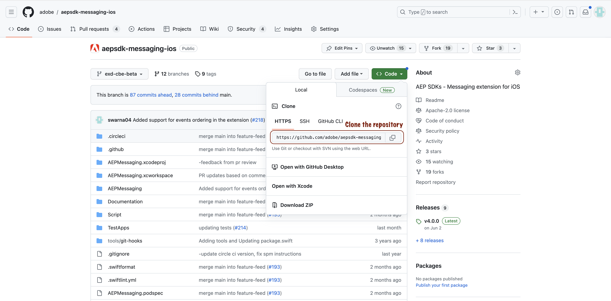
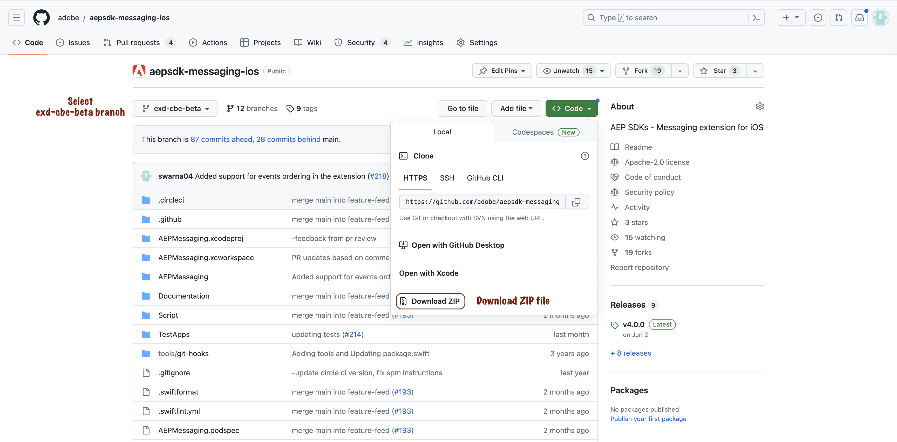
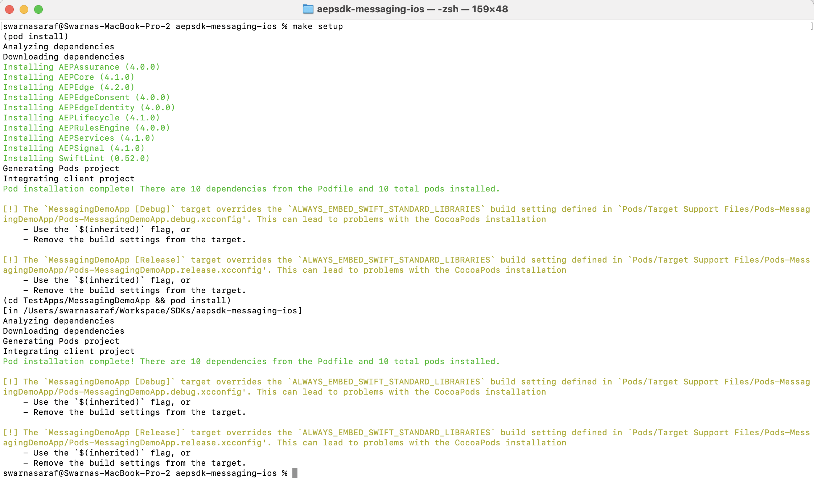
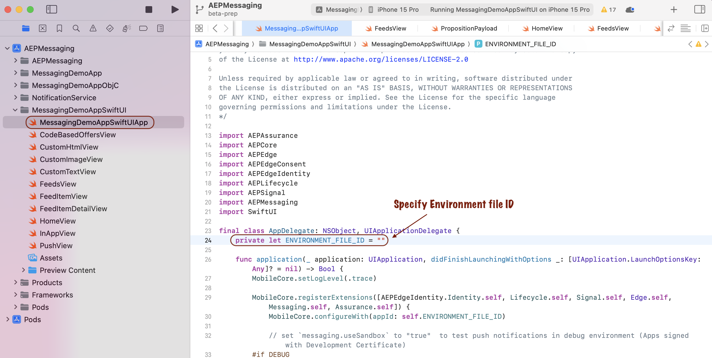
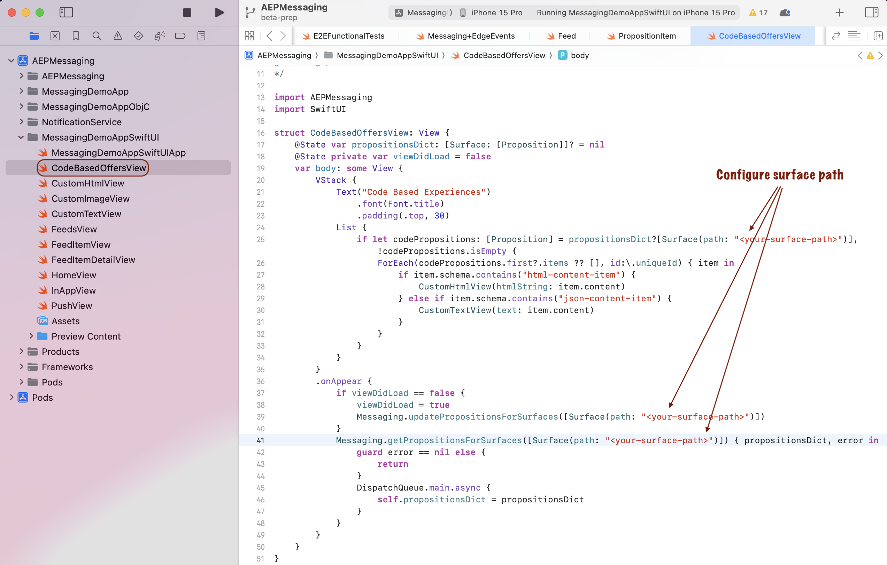
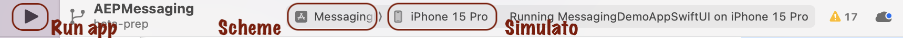

# Test app setup

## Setup

Please follow the below setup steps for iOS apps:

1. Install Xcode - https://developer.apple.com/xcode/
2. Get the Messaging SwiftUI test app from the GitHub repository - https://github.com/adobe/aepsdk-messaging-ios by following option 2a or 2b.
    a. Clone the code from https://github.com/adobe/aepsdk-messaging-ios.git. Checkout `exd-cbe-beta` branch.
    
    b. Select the `exd-cbe-beta` branch and download the code ZIP file.
    
3. Open the root directory in the terminal app and run `make setup`.

4. While in the root directory, run `make open` command to open the Messaging workspace file in Xcode.
5. Configure the app for the following:
    a. Set the `ENVIRONMENT_FILE_ID` value in MessagingDemoAppSwiftUIApp.swift (located in TestApps/MessagingDemoAppSwiftUI directory) for the appropriate environment.
    
    b. Modify the surface path in CodeBasedOffersView.swift (located in TestApps/MessagingDemoAppSwiftUI directory).
    
6. Select the build scheme `MessagingDemoAppSwiftUI` for the app target and select the preferred simulator, then run the app.

7. In the testapp, select the `Code Experiences` tab from the tab bar. You should see the Code-based experiences for your configured surface (mobileapp://com.adobe.MessagingDemoApp/<your-surface-path>).