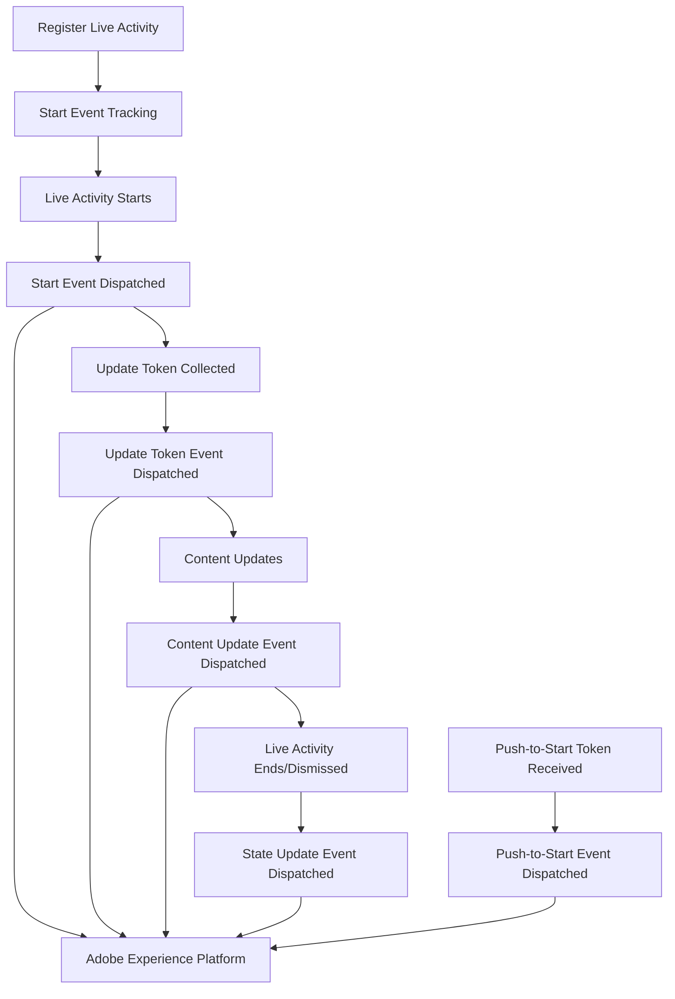

# Live Activity Event Tracking

The AEP Messaging SDK automatically tracks comprehensive events for Live Activities, providing detailed analytics and insights into user engagement and activity performance.

## Overview

Event tracking enables you to:

- **Monitor Live Activity Performance** - Track start, update, and end events
- **Analyze User Engagement** - Understand how users interact with Live Activities
- **Optimize Campaigns** - Use data to improve Live Activity content and timing
- **Integrate with Adobe Experience Platform** - Send data to AEP for advanced analytics

## Automatic Event Tracking

The SDK automatically tracks the following events without any additional code:

### 1. Live Activity Start Event

**Triggered:** When a Live Activity begins

**Event Name:** `com.adobe.eventType.messaging.liveActivity.start`

**Event Data:**
```swift
[
    "trackStart": true,
    "attributeType": "FoodDeliveryLiveActivityAttributes",
    "appleId": "activityAppleId",
    "origin": "local", // or "remote"
    "liveActivityId": "order_12345" // for individual activities
    // OR
    "channelId": "flight_ABC123" // for broadcast activities
]
```

**Use Cases:**
- Track Live Activity initiation
- Measure campaign effectiveness
- Analyze user engagement patterns

### 2. Live Activity State Update Event

**Triggered:** When a Live Activity state changes (dismissed/ended)

**Event Name:** `com.adobe.eventType.messaging.liveActivity.stateUpdate`

**Event Data:**
```swift
[
    "trackState": true,
    "attributeType": "FoodDeliveryLiveActivityAttributes",
    "appleId": "activityAppleId",
    "state": "dismissed", // or "ended"
    "liveActivityId": "order_12345" // for individual activities
    // OR
    "channelId": "flight_ABC123" // for broadcast activities
]
```

**Use Cases:**
- Track Live Activity completion rates
- Measure user retention
- Analyze dismissal patterns

### 3. Push-to-Start Token Event

**Triggered:** When a push-to-start token is received (iOS 17.2+)

**Event Name:** `com.adobe.eventType.messaging.liveActivity.pushToStart`

**Event Data:**
```swift
[
    "pushToStartToken": true,
    "token": "hexEncodedToken",
    "attributeType": "FoodDeliveryLiveActivityAttributes"
]
```

**Use Cases:**
- Enable remote Live Activity triggering
- Track token collection success
- Monitor remote activation capabilities

### 4. Update Token Event

**Triggered:** When a Live Activity's push token is updated

**Event Name:** `com.adobe.eventType.messaging.liveActivity.updateToken`

**Event Data:**
```swift
[
    "updateToken": true,
    "token": "hexEncodedToken",
    "attributeType": "FoodDeliveryLiveActivityAttributes",
    "appleId": "activityAppleId",
    "liveActivityId": "order_12345"
]
```

**Use Cases:**
- Enable real-time Live Activity updates
- Track token refresh success
- Monitor update delivery capabilities

### 5. Content State Update Event (Debug Only)

**Triggered:** When Live Activity content updates (DEBUG mode, iOS 16.2+)

**Event Name:** `com.adobe.eventType.messaging.liveActivity.contentUpdate`

**Event Data:**
```swift
[
    "contentUpdate": true,
    "attributeType": "FoodDeliveryLiveActivityAttributes",
    "appleId": "activityAppleId",
    "contentState": "updatedStateData"
]
```

**Use Cases:**
- Debug content update flows
- Monitor state change frequency
- Validate update delivery

## Event Flow Diagram



## Implementation Examples

### Basic Event Tracking

```swift
@available(iOS 16.1, *)
class LiveActivityTracker {
    
    func startFoodDeliveryTracking() {
        // Register for automatic event tracking
        Messaging.registerLiveActivity(FoodDeliveryLiveActivityAttributes.self)
        
        // Start Live Activity
        let attributes = FoodDeliveryLiveActivityAttributes(
            liveActivityData: LiveActivityData(liveActivityID: "order_12345"),
            restaurantName: "Pizza Hut"
        )
        
        let contentState = FoodDeliveryLiveActivityAttributes.ContentState(
            orderStatus: "Ordered"
        )
        
        do {
            let activity = try Activity.request(
                attributes: attributes,
                contentState: contentState,
                pushType: nil
            )
            // Events are automatically tracked
            print("Live Activity started with ID: \(activity.id)")
        } catch {
            print("Failed to start Live Activity: \(error)")
        }
    }
    
    func updateDeliveryStatus(activity: Activity<FoodDeliveryLiveActivityAttributes>, status: String) {
        let newContentState = FoodDeliveryLiveActivityAttributes.ContentState(
            orderStatus: status
        )
        
        Task {
            await activity.update(using: newContentState)
            // Content update events are automatically tracked in debug mode
        }
    }
    
    func endDeliveryActivity(activity: Activity<FoodDeliveryLiveActivityAttributes>) {
        let finalContentState = FoodDeliveryLiveActivityAttributes.ContentState(
            orderStatus: "Delivered"
        )
        
        Task {
            await activity.end(using: finalContentState, dismissalPolicy: .immediate)
            // State update event is automatically tracked
        }
    }
}
```

### Custom Event Listener

```swift
class LiveActivityEventListener: NSObject, Extension {
    
    public var name = "com.adobe.liveActivityEventListener"
    public var friendlyName = "Live Activity Event Listener"
    public var version = "1.0.0"
    public var metadata: [String: String]?
    public var runtime: ExtensionRuntime
    
    public required init?(runtime: ExtensionRuntime) {
        self.runtime = runtime
    }
    
    public func onRegistered() {
        // Listen for Live Activity events
        registerListener(type: EventType.messaging, source: EventSource.requestContent, listener: handleLiveActivityEvent)
    }
    
    private func handleLiveActivityEvent(event: Event) {
        guard let eventName = event.name else { return }
        
        switch eventName {
        case "com.adobe.eventType.messaging.liveActivity.start":
            handleStartEvent(event)
        case "com.adobe.eventType.messaging.liveActivity.stateUpdate":
            handleStateUpdateEvent(event)
        case "com.adobe.eventType.messaging.liveActivity.updateToken":
            handleUpdateTokenEvent(event)
        case "com.adobe.eventType.messaging.liveActivity.pushToStart":
            handlePushToStartEvent(event)
        default:
            break
        }
    }
    
    private func handleStartEvent(_ event: Event) {
        guard let data = event.data,
              let attributeType = data["attributeType"] as? String,
              let appleId = data["appleId"] as? String else { return }
        
        print("Live Activity started: \(attributeType) with Apple ID: \(appleId)")
        
        // Send to your analytics service
        Analytics.track("live_activity_started", properties: [
            "attribute_type": attributeType,
            "apple_id": appleId,
            "origin": data["origin"] as? String ?? "unknown"
        ])
    }
    
    private func handleStateUpdateEvent(_ event: Event) {
        guard let data = event.data,
              let attributeType = data["attributeType"] as? String,
              let state = data["state"] as? String else { return }
        
        print("Live Activity state updated: \(attributeType) - \(state)")
        
        // Send to your analytics service
        Analytics.track("live_activity_state_updated", properties: [
            "attribute_type": attributeType,
            "state": state
        ])
    }
    
    private func handleUpdateTokenEvent(_ event: Event) {
        guard let data = event.data,
              let attributeType = data["attributeType"] as? String,
              let token = data["token"] as? String else { return }
        
        print("Update token received for: \(attributeType)")
        
        // Store token for remote updates
        TokenManager.storeUpdateToken(token, for: attributeType)
    }
    
    private func handlePushToStartEvent(_ event: Event) {
        guard let data = event.data,
              let attributeType = data["attributeType"] as? String,
              let token = data["token"] as? String else { return }
        
        print("Push-to-start token received for: \(attributeType)")
        
        // Store token for remote triggering
        TokenManager.storePushToStartToken(token, for: attributeType)
    }
}
```

## Analytics Integration

### Adobe Experience Platform Integration

Events are automatically sent to Adobe Experience Platform with the following XDM schema:

```json
{
  "eventType": "messaging.liveActivity.start",
  "timestamp": "2024-01-15T10:30:00Z",
  "messaging": {
    "liveActivity": {
      "attributeType": "FoodDeliveryLiveActivityAttributes",
      "appleId": "activityAppleId",
      "origin": "local",
      "liveActivityId": "order_12345"
    }
  }
}
```

### Custom Analytics Integration

```swift
class LiveActivityAnalytics {
    
    static func trackStartEvent(attributeType: String, appleId: String, origin: String) {
        // Send to your analytics service
        Analytics.track("live_activity_started", properties: [
            "attribute_type": attributeType,
            "apple_id": appleId,
            "origin": origin,
            "timestamp": Date().timeIntervalSince1970
        ])
    }
    
    static func trackStateUpdateEvent(attributeType: String, state: String) {
        Analytics.track("live_activity_state_updated", properties: [
            "attribute_type": attributeType,
            "state": state,
            "timestamp": Date().timeIntervalSince1970
        ])
    }
    
    static func trackTokenEvent(attributeType: String, tokenType: String) {
        Analytics.track("live_activity_token_received", properties: [
            "attribute_type": attributeType,
            "token_type": tokenType,
            "timestamp": Date().timeIntervalSince1970
        ])
    }
}
```

## Event Data Schema

### Common Event Fields

All Live Activity events include these common fields:

```swift
struct LiveActivityEventData {
    let attributeType: String      // The Live Activity type
    let appleId: String           // Apple's activity identifier
    let timestamp: Date           // Event timestamp
    let origin: String?           // "local" or "remote"
    let liveActivityId: String?   // Your custom identifier
    let channelId: String?        // For broadcast activities
}
```

### Event-Specific Fields

```swift
// Start Event
struct StartEventData: LiveActivityEventData {
    let trackStart: Bool = true
}

// State Update Event
struct StateUpdateEventData: LiveActivityEventData {
    let trackState: Bool = true
    let state: String // "dismissed" or "ended"
}

// Token Events
struct TokenEventData: LiveActivityEventData {
    let token: String
    let tokenType: String // "pushToStart" or "update"
}
```

## Debugging and Monitoring

### Enable Debug Logging

```swift
// Enable detailed logging
MobileCore.setLogLevel(.trace)

// Look for these log messages:
// "Dispatching Live Activity start event"
// "Dispatching Live Activity state update event"
// "Dispatching Live Activity update token event"
// "Dispatching Live Activity push-to-start token event"
```

### Event Monitoring

```swift
class EventMonitor {
    
    static func monitorLiveActivityEvents() {
        // Listen for all messaging events
        NotificationCenter.default.addObserver(
            forName: NSNotification.Name("com.adobe.eventType.messaging"),
            object: nil,
            queue: .main
        ) { notification in
            if let event = notification.object as? Event {
                print("Live Activity Event: \(event.name ?? "unknown")")
                print("Event Data: \(event.data ?? [:])")
            }
        }
    }
}
```

## Best Practices

### Event Tracking Best Practices

1. **Register Early**: Register Live Activity types during app initialization
2. **Monitor Events**: Set up event listeners to track custom metrics
3. **Handle Errors**: Implement proper error handling for event failures
4. **Test Thoroughly**: Test event tracking in both debug and release modes
5. **Validate Data**: Ensure event data is properly formatted before sending

### Performance Considerations

1. **Event Batching**: Events are automatically batched for optimal performance
2. **Network Efficiency**: Events are sent efficiently to minimize battery usage
3. **Storage Management**: Event data is managed to prevent memory issues
4. **Background Processing**: Events are processed in the background to avoid UI blocking

## Platform Compatibility

| Feature | iOS Version | Description |
|---------|-------------|-------------|
| Start Events | 16.1+ | Track Live Activity initiation |
| State Update Events | 16.1+ | Track Live Activity lifecycle |
| Update Token Events | 16.1+ | Track token collection |
| Push-to-Start Events | 17.2+ | Track remote activation tokens |
| Content Update Events | 16.2+ | Debug mode only |

## Integration with Other Features

Live Activity events integrate seamlessly with other AEP Messaging features:

- **Push Notifications**: Coordinate with push notification events
- **In-App Messaging**: Track interactions between Live Activities and in-app messages
- **Content Cards**: Monitor engagement across different messaging channels
- **Propositions**: Use event data to personalize Live Activity content 