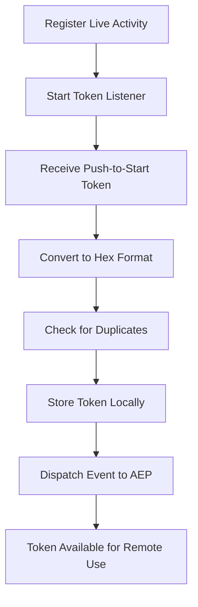
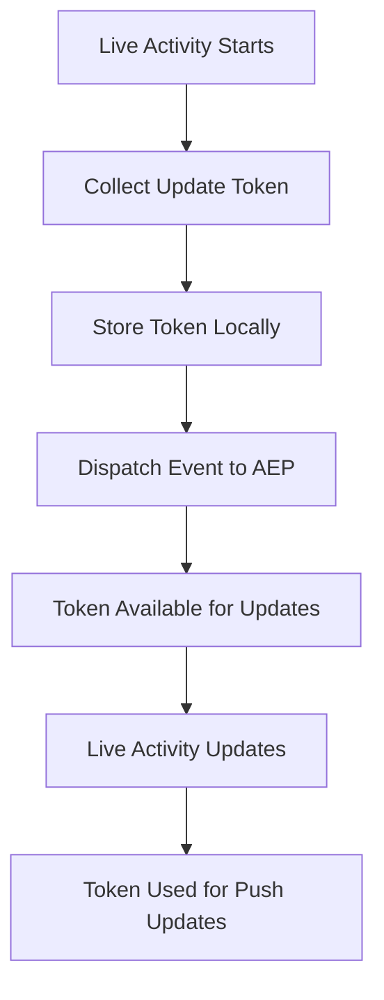

# Live Activity Token Management

The AEP Messaging SDK provides automatic token management for Live Activities, handling both push-to-start tokens and update tokens seamlessly.

## Overview

Live Activities use two types of push tokens:

1. **Push-to-Start Tokens** (iOS 17.2+) - Used to trigger Live Activities remotely
2. **Update Tokens** - Used to send updates to active Live Activities

The SDK automatically collects, stores, and manages these tokens, eliminating the need for manual token handling.

## Token Types

### Push-to-Start Tokens

**Purpose:** Enable remote triggering of Live Activities via push notifications.

**Availability:** iOS 17.2 and later

**Collection:** Automatically collected when you register a Live Activity type with the SDK.

**Usage:** Sent to Adobe Experience Platform for remote Live Activity management.

```swift
// The SDK automatically collects push-to-start tokens
Messaging.registerLiveActivity(FoodDeliveryLiveActivityAttributes.self)
```

### Update Tokens

**Purpose:** Send updates to active Live Activities.

**Availability:** iOS 16.1 and later

**Collection:** Automatically collected when a Live Activity starts.

**Usage:** Used by Adobe Experience Platform to send real-time updates to Live Activities.

## Automatic Token Management

### Registration Process

When you register a Live Activity type, the SDK automatically sets up token collection:

```swift
@available(iOS 16.1, *)
Messaging.registerLiveActivity(FoodDeliveryLiveActivityAttributes.self)
```

**What happens automatically:**

1. **Push-to-Start Token Task** (iOS 17.2+):
   - Listens for `Activity<T>.pushToStartTokenUpdates`
   - Converts tokens to hexadecimal format
   - Dispatches events to Adobe Experience Platform
   - Ignores duplicate tokens

2. **Activity Updates Task**:
   - Monitors `Activity<T>.activityUpdates`
   - Tracks Live Activity lifecycle
   - Collects update tokens for each activity
   - Monitors state transitions

### Token Storage

The SDK uses a persistence layer to store tokens locally:

```swift
// Token storage structure
struct PushToStartToken: Codable, Equatable {
    let firstIssued: Date
    let token: String
}

struct UpdateToken: Codable, Equatable, Expirable {
    let attributeType: String
    let firstIssued: Date
    let token: String
    var referenceDate: Date { firstIssued }
}
```

### Token Expiration

Update tokens automatically expire based on TTL (Time To Live) settings:

- **Default TTL:** 24 hours
- **Configurable:** Can be adjusted per Live Activity type
- **Automatic Cleanup:** Expired tokens are automatically removed

## Event Flow

### Push-to-Start Token Flow



### Update Token Flow



## Implementation Examples

### Basic Token Collection

```swift
@available(iOS 16.1, *)
class LiveActivityManager {
    
    func setupLiveActivities() {
        // Register Live Activity types
        Messaging.registerLiveActivity(FoodDeliveryLiveActivityAttributes.self)
        Messaging.registerLiveActivity(GameScoreLiveActivityAttributes.self)
        Messaging.registerLiveActivity(AirplaneTrackingAttributes.self)
    }
    
    func startFoodDeliveryActivity() {
        let attributes = FoodDeliveryLiveActivityAttributes(
            liveActivityData: LiveActivityData(liveActivityID: "order_12345"),
            restaurantName: "Pizza Hut"
        )
        
        let contentState = FoodDeliveryLiveActivityAttributes.ContentState(
            orderStatus: "Ordered"
        )
        
        do {
            let activity = try Activity.request(
                attributes: attributes,
                contentState: contentState,
                pushType: nil
            )
            // Update token will be automatically collected
            print("Live Activity started: \(activity.id)")
        } catch {
            print("Failed to start Live Activity: \(error)")
        }
    }
}
```

### Token Monitoring (Debug)

```swift
class TokenCollector: NSObject, ObservableObject, Extension {
    
    // Static properties to store push tokens
    static var gameScorePushToStartToken: String = ""
    static var foodDeliveryPushToStartToken: String = ""
    static var airplaneTrackingPushToStartToken: String = ""
    
    public func onRegistered() {
        registerListener(type: EventType.hub, source: EventSource.sharedState, listener: handleSharedStateEvent)
    }
    
    private func handleSharedStateEvent(event: Event) {
        if (event.data?["stateowner"] as! String == "com.adobe.messaging") {
            let messagingState = runtime.getSharedState(extensionName: "com.adobe.messaging", event: nil, barrier: false)?.value
            
            if let sharedState = messagingState,
               let liveActivity = sharedState["liveActivity"] as? [String: Any],
               let pushToStartTokens = liveActivity["pushToStartTokens"] as? [String: Any] {
                
                // Extract tokens for different Live Activity types
                if let gameScoreToken = pushToStartTokens["GameScoreLiveActivityAttributes"] as? [String: Any],
                   let token = gameScoreToken["token"] as? String {
                    DispatchQueue.main.async {
                        TokenCollector.gameScorePushToStartToken = token
                        NSLog("Updated GameScore push-to-start token: \(token)")
                    }
                }
                
                if let foodDeliveryToken = pushToStartTokens["FoodDeliveryLiveActivityAttributes"] as? [String: Any],
                   let token = foodDeliveryToken["token"] as? String {
                    DispatchQueue.main.async {
                        TokenCollector.foodDeliveryPushToStartToken = token
                        NSLog("Updated FoodDelivery push-to-start token: \(token)")
                    }
                }
            }
        }
    }
}
```

## Remote Live Activity Triggering

### Using Push-to-Start Tokens

Once tokens are collected, you can trigger Live Activities remotely:

```swift
// Server-side implementation (pseudo-code)
func triggerLiveActivity(liveActivityType: String, liveActivityId: String) {
    let pushToken = getStoredPushToStartToken(for: liveActivityType)
    
    let pushPayload = [
        "aps": [
            "alert": [
                "title": "Live Activity Update",
                "body": "Your Live Activity is starting"
            ],
            "category": "LIVE_ACTIVITY_START",
            "mutable-content": 1
        ],
        "LiveActivity": [
            "type": liveActivityType,
            "id": liveActivityId,
            "content": [
                "orderStatus": "Preparing",
                "estimatedDeliveryTime": "2024-01-15T14:30:00Z"
            ]
        ]
    ]
    
    sendPushNotification(to: pushToken, payload: pushPayload)
}
```

### Update Token Usage

Update tokens are used to send real-time updates to active Live Activities:

```swift
// Server-side implementation (pseudo-code)
func updateLiveActivity(liveActivityId: String, newContent: [String: Any]) {
    let updateToken = getStoredUpdateToken(for: liveActivityId)
    
    let pushPayload = [
        "aps": [
            "alert": [
                "title": "Order Update",
                "body": "Your order is on the way"
            ],
            "category": "LIVE_ACTIVITY_UPDATE",
            "mutable-content": 1
        ],
        "LiveActivity": [
            "id": liveActivityId,
            "content": newContent
        ]
    ]
    
    sendPushNotification(to: updateToken, payload: pushPayload)
}
```

## Token Security

### Best Practices

1. **Secure Storage**: Tokens are stored locally with encryption
2. **Token Rotation**: Update tokens are refreshed automatically
3. **Access Control**: Only authorized services can access tokens
4. **Audit Logging**: Token usage is logged for security monitoring

### Token Validation

The SDK validates tokens before use:

```swift
// Token validation checks
- Token format validation
- Token expiration checks
- Duplicate token detection
- Token ownership verification
```

## Troubleshooting

### Common Issues

1. **Missing Push-to-Start Tokens**
   - Ensure iOS 17.2+ is being used
   - Verify Live Activity capability is enabled
   - Check that registration was successful

2. **Update Tokens Not Received**
   - Verify Live Activity started successfully
   - Check network connectivity
   - Ensure proper event listener registration

3. **Token Expiration**
   - Tokens expire after 24 hours by default
   - New tokens are automatically collected
   - Check token refresh logs

### Debug Information

Enable debug logging to monitor token collection:

```swift
MobileCore.setLogLevel(.trace)
```

Look for these log messages:
- `"Registered Live Activity push-to-start token task"`
- `"Registered Live Activity updates task"`
- `"Dispatching Live Activity push-to-start token event"`
- `"Dispatching Live Activity update token event"`

## Platform Compatibility

| Feature | iOS Version | Description |
|---------|-------------|-------------|
| Push-to-Start Tokens | 17.2+ | Remote Live Activity triggering |
| Update Tokens | 16.1+ | Real-time Live Activity updates |
| Token Persistence | 16.1+ | Local token storage |
| Token Expiration | 16.1+ | Automatic token cleanup |

## Integration with Adobe Experience Platform

Tokens are automatically sent to Adobe Experience Platform for:

- **Analytics**: Track Live Activity engagement
- **Personalization**: Target specific users
- **Campaign Management**: Orchestrate Live Activity campaigns
- **Real-time Updates**: Send dynamic content to Live Activities 