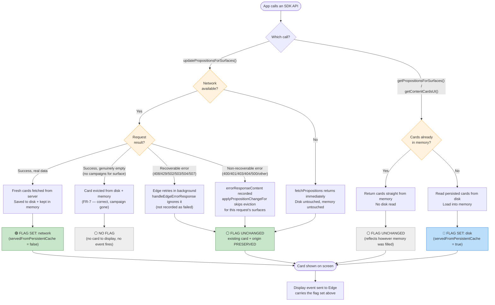

# `servedFromPersistentCache` flag — how and when it updates

Scenario-based view of when the content card `servedFromPersistentCache` flag gets set,
for the two SDK calls that can change it: `updatePropositionsForSurfaces()` and
`getPropositionsForSurfaces()` / `getContentCardsUI()`.

**Includes the error-handling fix**: a failed request (recoverable — Edge still retrying, or
non-recoverable — Edge's `errorResponseContent` event recorded) now leaves the flag and the
underlying card **completely unchanged**, instead of the old behavior where a non-recoverable
error could wipe both. See `persistence-write-path-and-errors.md` for the full error taxonomy.

## Summary

| Call | Condition | What happens | Flag after |
|------|-----------|---------------|-----------|
| `updatePropositionsForSurfaces()` | Network unavailable | Update never sent, disk & memory untouched | unchanged |
| `updatePropositionsForSurfaces()` | Success, real data returned | Fresh cards fetched, saved to disk + memory | `network` (`false`) |
| `updatePropositionsForSurfaces()` | Success, genuinely empty response | Card evicted (campaign gone — FR-7, correct) | no card, no flag |
| `updatePropositionsForSurfaces()` | Recoverable error (Edge still retrying) | Existing card + flag preserved | unchanged |
| `updatePropositionsForSurfaces()` | Non-recoverable error (`errorResponseContent`) | Existing card + flag preserved (fix) | unchanged |
| `getPropositionsForSurfaces()` / `getContentCardsUI()` | Cards already in memory | Returned directly, no disk read | unchanged |
| `getPropositionsForSurfaces()` / `getContentCardsUI()` | Cards not in memory | Read from disk, loaded into memory | `disk` (`true`) |

The flag is only ever **written** by a successful network update with real data (→ `network`) or a
disk hydrate that fills previously-empty memory (→ `disk`). Any call that returns data already
sitting in memory leaves the flag as-is. Critically, a **failed** update — recoverable or
non-recoverable — no longer touches the flag or the underlying card at all: only a genuinely empty
*successful* response is treated as "the campaign is gone."
