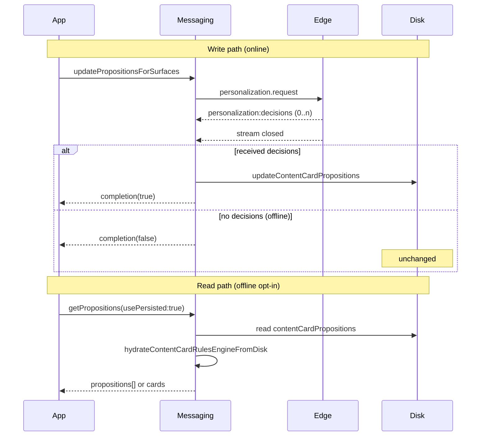

# Content Card Offline Availability — Agent Implementation Guide

**Branch:** `MOB-25109/offline-content-card-availability`  
**Last updated:** 2026-07-13  
**Scope:** iOS `AEPMessaging` — opt-in disk persistence and offline read for content cards

---

## 1. Requirements

### 1.1 Product goals

| ID | Requirement |
|----|-------------|
| R1 | Persist content card propositions to disk **only after a successful network update** (`updatePropositionsForSurfaces`). |
| R2 | On **failed** network update (offline, timeout, stream closed with no Adobe data), **do not mutate** persisted content card storage. |
| R3 | Provide **opt-in** offline read via `usePersistedContentCards: true` on `getPropositionsForSurfaces` and `getContentCardsUI`. Default remains in-memory session cache (`false`). |
| R4 | **No auto-hydrate** from disk on `Messaging` init (unlike IAM `loadCachedPropositions`). |
| R5 | `resetIdentities` must clear content card memory **and** disk (`contentCardPropositions` key). |
| R6 | Legitimate online **empty response** (Adobe sends decisions but zero campaigns for a surface) must still remove that surface from disk (`surfacesToRemove`). |

### 1.2 Non-goals (this change set)

- Inbox (`getInboxUI`) offline persistence — memory-only today.
- Public `clearCachedContentCardPropositions()` API — backlog.
- Option B dismiss disk eviction on `track(.dismiss)` — backlog.
- Skip persist for empty `items[]` shells (PLATIR-64717) — backlog.
- ObjC / React Native wrapper exposure for new APIs.

### 1.3 IAM vs content card parity

| Behavior | IAM | Content cards |
|----------|-----|---------------|
| Disk key | `propositions` | `contentCardPropositions` |
| Auto-hydrate on init | Yes (`loadCachedPropositions`) | No |
| `resetIdentities` clears disk | No (IAM kept) | Yes |
| Failed fetch mutates disk | Must not | Must not |
| Dismiss cold-start flash | IAM keeps rules on disk | Option B eviction open |

---

## 2. Public API surface

### 2.1 Update (network)

```swift
// Fire-and-forget (existing)
Messaging.updatePropositionsForSurfaces([surface])

// With completion — NEW ObjC-exposed wrapper
Messaging.updatePropositionsForSurfacesWithCompletionHandler([surface]) { success in
    // success == true  → Edge stream completed AND at least one personalization:decisions received
    // success == false → timeout, invalid surfaces, or stream closed with zero decisions
}
```

**File:** `AEPMessaging/Sources/Messaging+PublicAPI.swift`

### 2.2 Read (cache / disk)

```swift
Messaging.getPropositionsForSurfaces(
    [surface],
    usePersistedContentCards: false  // default: in-memory qualified cards
) { propositionsBySurface, error in }

Messaging.getPropositionsForSurfaces(
    [surface],
    usePersistedContentCards: true   // hydrate from disk first, then return
) { propositionsBySurface, error in }
```

**File:** `AEPMessaging/Sources/Messaging+PublicAPI.swift`

- Timeout: **5s** default; **10s** when `usePersistedContentCards: true`.
- Empty result returns `[]` with `error == nil` (not `AEPError.unexpected`).

### 2.3 UI API

```swift
Messaging.getContentCardsUI(
    for: surface,
    usePersistedContentCards: true,  // forwards to getPropositions with flag
    customizer: customizer,
    listener: listener
) { result in ... }
```

**File:** `AEPMessaging/Sources/UI/Messaging+UIPublicAPI.swift`

### 2.4 Demo app building cards from propositions

`ContentCardUI.createInstance(with:customizer:listener:)` made **public** so the demo app can build UI after `getPropositionsForSurfaces` without going through `getContentCardsUI`.

**File:** `AEPMessaging/Sources/UI/ContentCards/ContentCardUI.swift`

---

## 3. Architecture

### 3.1 Three layers

```text
┌─────────────────────────────────────────────────────────────┐
│  Network update (write path)                                   │
│  updatePropositionsForSurfaces → fetchPropositions → Edge    │
│  → personalization:decisions stream → applyPropositionChangeFor│
│  → cache.updateContentCardPropositions (disk)                  │
└─────────────────────────────────────────────────────────────┘

┌─────────────────────────────────────────────────────────────┐
│  Session memory (default read)                                 │
│  qualifiedContentCardsBySurface + content card rules engine    │
└─────────────────────────────────────────────────────────────┘

┌─────────────────────────────────────────────────────────────┐
│  Opt-in disk read                                            │
│  getPropositions(usePersistedContentCards: true)              │
│  → hydrateContentCardRulesEngineFromDisk                     │
│  → retrieveMessages → response to app                        │
└─────────────────────────────────────────────────────────────┘
```

### 3.2 Disk storage

| Constant | Value |
|----------|-------|
| Cache name | `com.adobe.messaging.cache` |
| CC disk key | `contentCardPropositions` |
| IAM disk key | `propositions` (unchanged) |

**Files:** `MessagingConstants.swift`, `Cache+Messaging.swift`

### 3.3 Write path (successful update)

1. `fetchPropositions` dispatches Edge event with `sendCompletion: true`.
2. Edge streams `personalization:decisions` → `handleEdgePersonalizationNotification` → `inProgressPropositions`.
3. Stream closes → `handleProcessCompletedEvent` → `endRequestFor`.
4. `ParsedPropositions` classifies ruleset consequences:
   - `.feed` / `.contentCard` → `contentCardPropositionsToPersist`
5. `applyPropositionChangeFor` → `cache.updateContentCardPropositions(...)`.
6. Rules engine updated; `qualifiedContentCardsBySurface` refreshed.

**Files:** `Messaging.swift`, `ParsedPropositions.swift`

### 3.4 Read path (opt-in offline)

1. App calls `getPropositionsForSurfaces(..., usePersistedContentCards: true)`.
2. Event carries `usepersistedcontentcards: true`.
3. `handleProcessEvent` → **immediate** `retrieveMessages` (bypasses event queue — see §4.3).
4. `hydrateContentCardRulesEngineFromDisk`:
   - Read `cache.contentCardPropositions`
   - `ParsedPropositions` → rules + propositionInfo
   - Replace content card rules engine rules
   - Seed evaluate → fill `qualifiedContentCardsBySurface`
5. `retrieveMessages` merges CC + CBE + inbox memory maps → response event.

**No trigger events** sent during hydrate (seed event only).

---

## 4. Critical implementation details

### 4.1 Failed fetch guard (`personalizationDecisionReceivedForEventId`)

**Problem:** Offline relaunch called `updatePropositionsForSurfaces` (AppDelegate). Edge stream closed with **zero** `personalization:decisions` events. Old code ran `applyPropositionChangeFor` with empty `inProgressPropositions` → `surfacesToRemove` wiped `contentCardPropositions` from disk.

**Fix:** Track request IDs that received at least one decisions event.

| Location | Action |
|----------|--------|
| `handleEdgePersonalizationNotification` | `insert(requestEventId)` when decisions event arrives |
| `endRequestFor` | If **not** in set AND `inProgressPropositions` empty → skip apply, `completion(false)` |
| `fetchPropositions` timeout | `remove(eventId)` cleanup |

**Legitimate empty online response:** Adobe still sends ≥1 decisions event → flag set → `applyPropositionChangeFor` runs → `surfacesToRemove` clears surface from disk as intended.

**File:** `Messaging.swift` — `endRequestFor`, `handleEdgePersonalizationNotification`, property at ~line 82.

### 4.2 Empty get-propositions response

**Problem:** Missing `propositions` key in response → public API returned `AEPError.unexpected` (error 0). Empty hydrate looked like a hard failure.

**Fix:**
- `retrieveMessages` always includes `propositions: []` in response data.
- `getPropositionsForSurfaces` uses `responseEvent.propositions ?? []`.

### 4.3 Persisted read bypasses event queue

**Problem:** `getPropositions` was queued behind in-flight Edge updates. Public API 5s timeout → `AEPError.callbackTimeout` (error 1) on offline Log Props flow.

**Fix:** When `event.usePersistedContentCards == true`, call `retrieveMessages` immediately instead of `eventsQueue.add(event)`.

Disk hydrate does not depend on completing network updates.

### 4.4 Identity reset

`handleResetIdentitiesEvent` calls `clearContentCards()`:
- Clears `qualifiedContentCardsBySurface`, `contentCardRulesBySurface`
- Replaces CC rules engine with `[]`
- Removes `contentCardPropositions` cache key

### 4.5 Persist success logging

Debug log in `applyPropositionChangeFor` when `contentCardPropositionsToPersist` is non-empty:

```text
Content card propositions saved to persisted disk successfully (N proposition(s) across M surface(s)).
```

---

## 5. Files changed

### 5.1 SDK sources

| File | Change |
|------|--------|
| `Cache+Messaging.swift` | `contentCardPropositions` get/set; shared `updatePropositionsByKey` helper |
| `Event+Messaging.swift` | `usePersistedContentCards` event property |
| `MessagingConstants.swift` | `CONTENT_CARD_PROPOSITIONS`, `USE_PERSISTED_CONTENT_CARDS` keys |
| `ParsedPropositions.swift` | `contentCardPropositionsToPersist` bucket for `.feed`/`.contentCard` |
| `Messaging.swift` | Hydrate, failed-fetch guard, clear on reset, queue bypass, retrieveMessages fix |
| `Messaging+PublicAPI.swift` | `usePersistedContentCards` param, completion handler API, timeout/empty fixes |
| `Messaging+UIPublicAPI.swift` | `getContentCardsUI` forwards persisted flag |
| `ContentCardUI.swift` | `createInstance` made `public` |

### 5.2 Tests

| File | Coverage |
|------|----------|
| `Cache+MessagingTests.swift` | CC cache read/write; IAM key isolation |
| `Messaging+PublicApiTest.swift` | Persisted flag on get event; completion handler API |
| `Messaging+StateTests.swift` | `hydrateContentCardRulesEngineFromDisk`; get with persisted flag |
| `MessagingProcessCompletedEventTests.swift` | No decisions → disk not cleared |
| `ParsedPropositionsTests.swift` | CC persist bucket from feed ruleset |
| `Messaging+UIPublicApiTest.swift` | `getContentCardsUI` persisted flag |
| `MockCache.swift` | `setCalls` / `removeCalls` for assertions |

### 5.3 Demo app (`MessagingDemoAppSwiftUI`)

| File | Change |
|------|--------|
| `TabHeader.swift` | Optional **Offline** and **Log Props** buttons |
| `CardsView.swift` | Offline fallback flow, proposition logging, persist-success UI message |

---

## 6. Demo app flows

### 6.1 Buttons (Content Cards tab)

| Button | Function | Behavior |
|--------|----------|----------|
| **Refresh** | `refreshCards()` | `getPropositions(usePersisted: false)` → memory |
| **Download** | `downloadCards()` + `refreshCards()` | Fire update + memory read |
| **Offline** | `updatePropositionsWithOfflineFallback()` | Update → success: memory; failure: `usePersisted: true` |
| **Log Props** | `updateAndLogPropositions()` | Same branching; logs raw propositions on screen |

### 6.2 Recommended manual QA

1. **Online seed:** Launch with network → wait for cards OR tap Download → wait ~10s for update completion.
2. Confirm persist log: screen shows "saved to persisted disk" or SDK debug log.
3. **Kill app → disable network.**
4. Tap **Offline** or **Log Props** → should read from disk (cards or "no propositions"), not `callbackTimeout` / `unexpected`.
5. **resetIdentities** → disk cleared; offline read returns empty.

---

## 7. Event data keys

| Key | Event field | Purpose |
|-----|-------------|---------|
| `getpropositions` | bool | Get-propositions request |
| `usepersistedcontentcards` | bool | Hydrate CC from disk before read |
| `surfaces` | array | Requested surfaces |
| `propositions` | array | Response payload (may be `[]`) |

---

## 8. Common pitfalls (for agents)

1. **Refresh alone does not persist.** Only successful `updatePropositions` completion writes disk.
2. **AppDelegate launch update** runs every cold start. Failed fetch must not wipe disk (guard in `endRequestFor`).
3. **Do not confuse** `AEPError.unexpected` (0) vs `callbackTimeout` (1). Queue timeout was a separate bug from disk wipe.
4. **Dismiss** writes `dismiss` to Event History, not `disqualify`. Journey rules insert `disqualify` later.
5. **`surfacesToRemove`** on successful update: requested surface absent from response → delete from disk (not "empty array persist").
6. Rebuild demo app after SDK changes (`Cmd+Shift+K`); CocoaPods uses local `AEPMessaging` target.

---

## 9. Build & test

```bash
make pod-install   # if needed
make unit-test
make functional-test
make lint
```

Key test classes: `Cache+MessagingTests`, `MessagingPlusStateTests`, `MessagingProcessCompletedEventTests`, `Messaging+UIPublicApiTest`.

---

## 10. Open backlog (not in this PR)

1. **P0** — Option B: evict dismissed CC from memory + disk on `track(.dismiss)`.
2. **P1** — Public `clearCachedContentCardPropositions()`.
3. **P1** — Skip persist empty `items[]` in `ParsedPropositions`.
4. Functional tests for full offline E2E on device/simulator.
5. Sync Confluence PRD pages (`3950641911`, `3950641891`).

---

## 11. Reference flow (mermaid)


