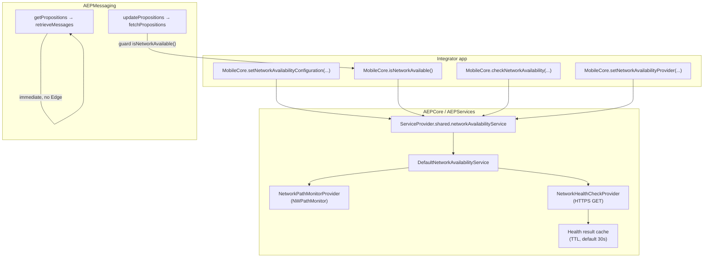

# Network Availability Layer — Context & Change Log

**Last updated:** 2026-07-20  
**Repos:** `aepsdk-core-ios` (AEPServices + AEPCore), `aepsdk-messaging-ios` (AEPMessaging)  
**Purpose:** Preserve design intent, API surface, integration points, and file map for the pluggable network availability work used by Content Card / Inbox offline UX.

---

## Problem statement

When the device is offline (or backend health is unknown), Messaging previously:

1. Dispatched Edge `personalization.request` events anyway
2. Waited for Edge recoverable retries + Event Hub / MobileCore dispatch timeouts (~5–10s)
3. Blocked `getPropositions` behind queued update work in `eventsQueue`

This produced poor offline UX for Content Cards even when disk cache was valid.

**Goal:** Add a **Mobile Core network availability layer** that:

- Gates network-bound SDK work before Edge queue flooding
- Exposes a **public API** integrators can reuse
- Supports an optional **customer health-check endpoint** (IP/URL) for backend certainty
- Is **plug-in / plug-out** via protocols and `ServiceProvider` overrides

---

## Architecture



### Layered checks

| Layer | Provider | Sync API | Async API | Purpose |
|-------|----------|----------|-----------|---------|
| **Device path** | `NetworkPathMonitorProvider` | Always consulted | Always consulted | Fast offline detection (airplane mode, no interface) |
| **Remote health** | `NetworkHealthCheckProvider` (optional) | Used only when `requireHealthCheckWhenConfigured == true` and cache is fresh | Always when configured | Customer endpoint confirms *their* system is up |
| **Custom** | App implements `NetworkAvailabilityProviding` | Full override | Full override | Enterprise VPN / captive portal / custom logic |

### Gating modes

**Default (recommended for Messaging offline UX):**

```swift
NetworkAvailabilityConfiguration(
    healthCheck: nil  // path monitor only
)
```

- `MobileCore.isNetworkAvailable()` → `NWPathMonitor.currentPath.status == .satisfied`
- Sub-millisecond synchronous gate
- Messaging skips Edge immediately when path is unsatisfied

**With customer health endpoint (backend certainty):**

```swift
let health = NetworkHealthCheckConfiguration(
    endpoint: URL(string: "https://10.20.30.40/health")!,  // customer IP/host
    timeout: 3,
    cacheTTL: 30
)
MobileCore.setNetworkAvailabilityConfiguration(
    NetworkAvailabilityConfiguration(
        healthCheck: health,
        requireHealthCheckWhenConfigured: false  // async health only
    )
)
```

- Sync gate still path-only (fast)
- Call `MobileCore.checkNetworkAvailability { ... }` before critical flows if needed
- Health results cached for `cacheTTL` to avoid flooding the endpoint

**Strict mode (block sync until health passes):**

```swift
MobileCore.setNetworkAvailabilityConfiguration(
    NetworkAvailabilityConfiguration(
        healthCheck: health,
        requireHealthCheckWhenConfigured: true
    )
)
// Prime cache once at startup:
MobileCore.checkNetworkAvailability { _ in }
```

- `MobileCore.isNetworkAvailable()` returns `false` until a passing health check is cached
- Prevents Edge dispatch when device has Wi‑Fi but customer backend is down

---

## Public API (Mobile Core)

| API | Description |
|-----|-------------|
| `MobileCore.setNetworkAvailabilityConfiguration(_:)` | Configure optional health endpoint + strict gating flag |
| `MobileCore.isNetworkAvailable()` | Fast synchronous gate for extensions and app code |
| `MobileCore.checkNetworkAvailability(completion:)` | Async path + optional health evaluation |
| `MobileCore.setNetworkAvailabilityProvider(_:)` | Replace entire implementation (plug-in) |
| `MobileCore.resetNetworkAvailabilityProvider()` | Restore defaults |

### Integrator example

```swift
import AEPCore

// Optional: customer health service on their network
if let endpoint = URL(string: "https://health.mycompany.internal/ping") {
    MobileCore.setNetworkAvailabilityConfiguration(
        NetworkAvailabilityConfiguration(
            healthCheck: NetworkHealthCheckConfiguration(endpoint: endpoint),
            requireHealthCheckWhenConfigured: false
        )
    )
}

// App UI or custom networking
if MobileCore.isNetworkAvailable() {
    // safe to call network APIs
}

MobileCore.checkNetworkAvailability { result in
    switch result.status {
    case .available, .pathOnly:
        // proceed
    case .deviceOffline, .healthCheckFailed:
        // show offline UI
    }
}
```

### Advanced plug-in example

```swift
final class CorporateVPNAvailabilityService: NetworkAvailabilityProviding {
    var configuration = NetworkAvailabilityConfiguration()

    func isNetworkAvailable() -> Bool { VPNMonitor.shared.isConnected }
    func checkNetworkAvailability(completion: @escaping (NetworkAvailabilityResult) -> Void) {
        completion(NetworkAvailabilityResult(status: isNetworkAvailable() ? .available : .deviceOffline))
    }
    func setPathProvider(_ provider: NetworkPathAvailabilityProviding) {}
    func setHealthCheckProvider(_ provider: NetworkHealthCheckProviding?) {}
    func resetToDefaults() {}
}

MobileCore.setNetworkAvailabilityProvider(CorporateVPNAvailabilityService())
```

---

## Pluggable protocols (AEPServices)

| Protocol | Role |
|----------|------|
| `NetworkPathAvailabilityProviding` | Device path check (`isPathAvailable()`) |
| `NetworkHealthCheckProviding` | Remote health probe (`performHealthCheck(completion:)`) |
| `NetworkAvailabilityProviding` | Full service surface + configuration |
| `NetworkConnectivityService` | Legacy bridge; `DefaultNetworkAvailabilityService` implements this |

`DefaultNetworkAvailabilityService` methods:

- `setPathProvider(_:)` — swap path layer
- `setHealthCheckProvider(_:)` — swap health layer (`nil` restores HTTP provider from config)
- `resetToDefaults()` — restore built-in providers and clear cache

---

## Messaging integration

**File:** `AEPMessaging/Sources/Messaging.swift`

| Event / path | Behavior when unavailable |
|--------------|---------------------------|
| `updatePropositions` | Skip `fetchPropositions`; completion `false` immediately; **no Edge event** |
| `fetchPropositions` (IAM refresh, cold start) | Same guard at top of method |
| `getPropositions` | **Immediate** `retrieveMessages()` — disk hydrate + response; not queued behind updates |

```swift
private func isNetworkAvailable() -> Bool {
    return MobileCore.isNetworkAvailable()
}
```

### Offline UX flow (Content Cards)

```
1. App: getPropositions(surfaces)     → retrieveMessages → disk hydrate → cards in response (fast)
2. App: updatePropositions(surfaces) → isNetworkAvailable() == false → completion(false), no Edge
3. App: getPropositions(surfaces)     → cached cards from step 1 / disk
```

No Edge queue flooding. No 5–10s timeout wait.

---

## File map

### aepsdk-core-ios / AEPServices

| File | Role |
|------|------|
| `NetworkAvailabilityResult.swift` | `NetworkAvailabilityStatus`, `NetworkAvailabilityResult` |
| `NetworkAvailabilityConfiguration.swift` | `NetworkHealthCheckConfiguration`, `NetworkAvailabilityConfiguration` |
| `NetworkAvailabilityProviding.swift` | Pluggable protocols |
| `NetworkPathMonitorProvider.swift` | Default `NWPathMonitor` path provider |
| `NetworkHealthCheckProvider.swift` | Default HTTPS GET health probe |
| `DefaultNetworkAvailabilityService.swift` | Composed path + health + cache implementation |
| `NetworkConnectivityService.swift` | Legacy protocol (still implemented by default service) |
| `NWPathNetworkConnectivityService.swift` | Thin legacy wrapper over path provider |
| `ServiceProvider.swift` | `networkAvailabilityService` + `networkConnectivityService` bridge |
| `Mocks/MockNetworkConnectivityService.swift` | `MockNetworkAvailabilityService`, `MockNetworkConnectivityService` |

### aepsdk-core-ios / AEPCore

| File | Role |
|------|------|
| `MobileCore+NetworkAvailability.swift` | Public customer-facing API |

### aepsdk-core-ios / Tests

| File | Role |
|------|------|
| `AEPServices/Tests/services/DefaultNetworkAvailabilityServiceTests.swift` | Composite service unit tests |
| `AEPServices/Tests/services/NetworkConnectivityServiceTests.swift` | ServiceProvider wiring |
| `AEPServices/Tests/services/ServiceProviderTests.swift` | Override / reset tests |
| `AEPCore/Tests/MobileCore+NetworkAvailabilityTests.swift` | Public API delegation tests |

### aepsdk-messaging-ios

| File | Role |
|------|------|
| `AEPMessaging/Sources/Messaging.swift` | Gates update/fetch; immediate get |
| `AEPMessaging/Tests/TestHelpers/MockNetworkConnectivityService.swift` | `MockNetworkAvailabilityService` for unit tests |
| `AEPMessaging/Tests/UnitTests/MessagingTests.swift` | Offline skip + immediate get tests |
| `Podfile` | `lib_main` uses `:path => '../aepsdk-core-ios'` for local co-dev |

---

## ServiceProvider wiring

```swift
ServiceProvider.shared.networkAvailabilityService  // primary
ServiceProvider.shared.networkConnectivityService  // legacy; delegates to availability when possible
ServiceProvider.shared.resetNetworkAvailabilityService()
```

Tests override via:

```swift
ServiceProvider.shared.networkAvailabilityService = MockNetworkAvailabilityService(isAvailable: false)
```

---

## Health check details

- **Protocol:** HTTPS only (same constraint as `NetworkService`)
- **Method:** GET
- **Success:** HTTP status in `expectedStatusCodes` (default 200–299)
- **Timeout:** configurable per `NetworkHealthCheckConfiguration` (default 3s)
- **Cache:** `cacheTTL` default 30s — prevents health endpoint flooding when extensions call sync gate frequently

---

## Pod / build notes

- Messaging `Podfile` points `AEPCore` / `AEPServices` to `../aepsdk-core-ios` for local development
- Run `make pod-install` in messaging after core changes
- Revert Podfile to CDN pods before release CI

---

## Testing

### Messaging (verified)

- `testHandleProcessEvent_updatePropositions_skipsEdgeWhenOffline`
- `testHandleProcessEvent_getPropositions_returnsWithoutQueueingBehindUpdate`

### Core

- `DefaultNetworkAvailabilityServiceTests` — path gate, health cache, path-only async
- `MobileCore+NetworkAvailabilityTests` — public API delegation
- `ServiceProviderTests` — override / reset

Run messaging unit tests:

```bash
cd aepsdk-messaging-ios
make pod-install
xcodebuild test -workspace AEPMessaging.xcworkspace -scheme UnitTests \
  -destination 'platform=iOS Simulator,id=<simulator-id>'
```

---

## Related offline work (Messaging)

This layer complements (does not replace):

| Topic | Doc |
|-------|-----|
| Content Card disk persistence | `docs/agents/content-card-offline-implementation.md` |
| Inbox + CBE delta | `docs/agents/inbox-cbe-offline-handoff.md` |
| PRD / architecture | Adobe wiki Messaging Offline Availability PRD |

---

## Open follow-ups

1. **Edge extension** — optionally consume `MobileCore.isNetworkAvailable()` before enqueueing hits (platform-wide queue protection)
2. **Strict health at startup** — demo app pattern: call `checkNetworkAvailability` once after `MobileCore.initialize`
3. **HEAD support** — add `HttpMethod.head` if customers require lighter health probes
4. **Podfile** — split `lib_local` vs CDN for CI when core PR merges
5. **Android parity** — equivalent service in `aepsdk-core-android` for cross-platform RN apps

---

## Change history

| Date | Change |
|------|--------|
| 2026-07-15 | Initial `NetworkConnectivityService` + Messaging offline gate (path monitor only) |
| 2026-07-20 | Expanded to pluggable `NetworkAvailabilityProviding`, health check config, `MobileCore` public API, context doc |
