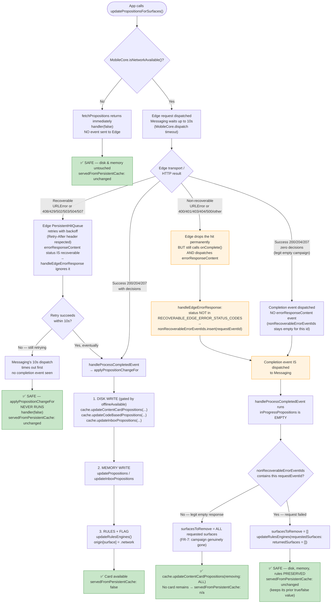

# Persistent disk + in-memory write path — full error taxonomy

Traces exactly how `contentCardPropositions` (disk) and `qualifiedContentCardsBySurface` (memory)
get written, overlaid with every error layer between the app and Adobe Experience Edge —
sourced from `aepsdk-edge-ios` (`EdgeNetworkService.swift`, `EdgeHitProcessor.swift`,
`NetworkResponseHandler.swift`) and `aepsdk-core-ios` (`URLError+Recoverable.swift`,
`NetworkServiceConstants.swift`).

**Status: fix implemented.** Messaging now listens for Edge's `errorResponseContent` event
(mirroring the pattern already used by `aepsdk-optimize-ios`) and uses it to distinguish a
genuinely empty server response from a failed request, so a non-recoverable error can no
longer evict a surface's persisted cache, in-memory cards, or content card origin tag.

## Error taxonomy (from the Edge repo)

| Layer | Recoverable | Non-recoverable |
|-------|-------------|------------------|
| **Transport (`URLError`, before any HTTP response)** | `.timedOut`, `.cannotConnectToHost`, `.networkConnectionLost`, `.notConnectedToInternet`, `.dataNotAllowed` | any other `URLError` (bad URL, cancelled, unsupported scheme, TLS/cert failure, etc.) |
| **HTTP status (response received)** | `408`, `429`, `502`, `503`, `504`, `507` | `400`, `401`, `403`, `404`, `500`, and all other codes not in the recoverable set |

Recoverable errors are retried by **Edge's own `PersistentHitQueue`** with backoff (`Retry-After`
header respected for status codes; fixed `RETRY_INTERVAL` for transport errors) — entirely inside
the Edge extension, invisible to Messaging until either a completion event arrives or Messaging's
own dispatch timeout fires first.

Non-recoverable errors cause Edge to **drop the hit permanently**, but Edge still calls
`responseCallback.onComplete()` — a completion event is dispatched back to Messaging even though
nothing succeeded. Separately, Edge **also** dispatches a dedicated
`com.adobe.eventSource.errorResponseContent` event (via `NetworkResponseHandler.dispatchEventErrors`)
carrying the `status`/`type`/`title`/`detail` of the failure, tagged with the same `requestEventId`.
This is the signal Messaging now listens for.

## Diagram



## The fix

**File:** `AEPMessaging/Sources/Messaging.swift`

1. **New listener** — registered in `onRegistered()`, mirrors Optimize's existing pattern:

```swift
registerListener(type: EventType.edge,
                 source: MessagingConstants.Event.Source.EDGE_ERROR_RESPONSE,
                 listener: handleEdgeErrorResponse)
```

2. **New tracking set** — `nonRecoverableErrorEventIds: Set<String>`, keyed by the same
   `requestEventId` used by `requestedSurfacesForEventId`.

3. **New handler** — classifies the error using the same status codes Edge itself retries on:

```swift
static let RECOVERABLE_EDGE_ERROR_STATUS_CODES: Set<Int> = [408, 429, 502, 503, 504, 507]

private func handleEdgeErrorResponse(_ event: Event) {
    guard event.isEdgeErrorResponseEvent,
          let requestEventId = event.requestEventId,
          requestedSurfacesForEventId.contains(where: { $0.key == requestEventId })
    else { return }

    if let status = event.edgeErrorStatus, MessagingConstants.RECOVERABLE_EDGE_ERROR_STATUS_CODES.contains(status) {
        return // Edge is already retrying this — not a failure yet
    }
    nonRecoverableErrorEventIds.insert(requestEventId)
}
```

4. **Guard in `applyPropositionChangeFor`** — when the request id is flagged, eviction is skipped
   entirely for both the disk/memory removal path and the rules-engine/qualified-cards path:

```swift
let requestFailed = nonRecoverableErrorEventIds.contains(eventId)
let surfacesToRemove = requestFailed ? [] : requestedSurfaces.minus(returnedSurfaces)
...
updateRulesEngines(with: parsedPropositions.surfaceRulesBySchemaType,
                  requestedSurfaces: requestFailed ? returnedSurfaces : requestedSurfaces)
```

Passing `returnedSurfaces` (empty on full failure) instead of `requestedSurfaces` into
`updateRulesEngines` matters because that same parameter drives **two** separate eviction paths
downstream: `processRulesForSchemaType`'s else-branch (clears `contentCardRulesBySurface` for
every requested surface when the schema key is entirely absent from the response) and
`removeOrReplaceContentCards` (evicts `qualifiedContentCardsBySurface` **and**
`contentCardOriginBySurface` for any requested surface not present in the qualified result). One
guard protects all three destinations.

5. **Cleanup** — the tracking set is cleared per-request-id in `endRequestFor` (after
   `applyPropositionChangeFor` uses it) and in the dispatch-timeout branch of `fetchPropositions`,
   so it cannot grow unbounded.

## Now-corrected behavior

| Scenario | Edge behavior | Messaging behavior | Correct? |
|----------|---------------|---------------------|----------|
| Server genuinely has no active campaign for the surface | `200`, empty decisions, `onComplete()` fires, **no** `errorResponseContent` | `surfacesToRemove` = requested surfaces → disk evicted | ✅ correct — FR-7, campaign no longer active |
| Non-recoverable HTTP error (`404`, `500`, `401`, ...) | error dispatched **and** `errorResponseContent` fires, `onComplete()` still fires | `nonRecoverableErrorEventIds` contains this request → `surfacesToRemove = []` → **nothing evicted** | ✅ fixed |
| Non-recoverable `URLError` (bad cert, cancelled, unsupported URL) | same as above | same guard applies | ✅ fixed |
| Recoverable status (`408/429/502/503/504/507`) via `errorResponseContent` | Edge is already retrying | `handleEdgeErrorResponse` explicitly ignores recoverable statuses — not recorded | ✅ correct, matches Edge's own retry semantics |

## What was already safe (unchanged)

| Scenario | Why it's safe |
|----------|----------------|
| No network at all | `fetchPropositions` returns before any event is sent — nothing to react to |
| Recoverable error, Edge retry completes before Messaging's 10s timeout | Normal success path, correct |
| Recoverable error, Edge still retrying past 10s | Messaging's dispatch times out with **no completion event** at all — `applyPropositionChangeFor` never runs |
| Successful response with real decisions | Disk written (gated by `offlineAvailable`), memory updated, origin tagged `.network` |

## Origin flag behavior in error cases (now correct end-to-end)

Previously, `contentCardOriginBySurface` was evicted alongside memory whenever
`removeOrReplaceContentCards` ran for a surface absent from the qualified result — including the
non-recoverable-error case. With the guard above, a failed request now passes an empty
`requestedSurfaces` list into `updateRulesEngines`, so `removeOrReplaceContentCards`'s eviction
loop has nothing to iterate and the origin tag for that surface is left completely untouched.
A card that was `.network` or `.disk` before a transient server error stays exactly that after it.

## Public API impact

**None.** No new parameters on `updatePropositionsForSurfaces`, `getPropositionsForSurfaces`, or
`getContentCardsUI`. Completion handler semantics (`(Bool) -> Void`) are unchanged — this is
entirely internal listener + state-tracking plumbing, matching the pattern Optimize already uses
for the same Edge event source.

## Note: Optimize itself does not do this

While researching this fix, `aepsdk-optimize-ios`'s `processEdgeErrorResponse` was found to
**record** the error (surfacing it to the app's completion callback) but its
`updateCachedPropositions` does **not** check that record before evicting `scopesToRemove` from
its in-memory cache. Optimize has the same latent gap Messaging had — it matters less there only
because Optimize has no disk persistence to lose. Messaging's fix goes one step further than the
Optimize precedent by actually gating the eviction on the recorded error, not just logging it.
